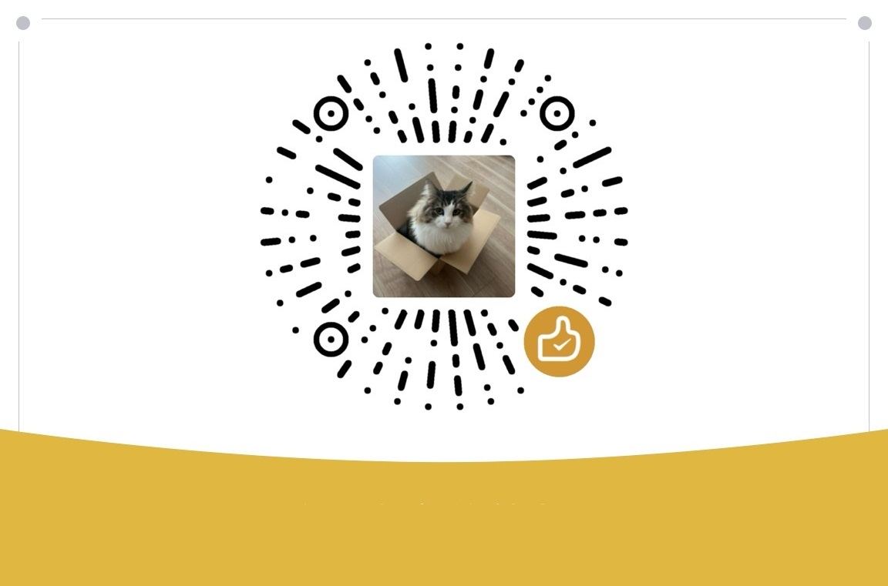

# collect-tv-txt

自动收集整理直播源

| 类别  | 文件名  | 更新频率                                       | 备注   |
|-------|-------|------------------------------------------------|------------|
|直播源| （merged_output.txt） |  每日自动更新 | http://gg.gg/tv-live-txt     |
|直播源| （merged_output.m3u） |  每日自动更新 | http://gg.gg/tv-live-m3u   |
|黑名单| （blacklist_auto.txt） |  不定时更新 | 无效直播源会从直播源过滤掉   |
|白名单| （whitelist_auto.txt） |  不定时更新 | 高响应源汇总到直播源   |

### **直播源（txt）：**
```
https://raw.githubusercontent.com/kimwang1978/collect-tv-txt/main/merged_output.txt
```
直播源（txt）短链：

http://gg.gg/tv-live-txt   

直播源（txt）短链（Backup）：

https://tinyurl.com/tv-live-txt

https://go.click.ly/inwPk

镜像源（txt）：（墙内推荐↓↓↓）
```
https://ghproxy.net/https://raw.githubusercontent.com/kimwang1978/collect-tv-txt/main/merged_output.txt
```
镜像源（txt）短链：（墙内推荐↓↓↓）

http://gg.gg/tv-live-txt-mirr

### **直播源（m3u）：**
```
https://raw.githubusercontent.com/kimwang1978/collect-tv-txt/main/merged_output.m3u
```
直播源（m3u）短链：

http://gg.gg/tv-live-m3u 

镜像源（m3u）短链：（墙内推荐↓↓↓）

http://gg.gg/tv-live-m3u-mirr


| 类 别  | 直播源                                       | ShortLink   |
|-------|------------------------------------------------|------------|
| （txt） |  https://raw.githubusercontent.com/kimwang1978/collect-tv-txt/main/merged_output.txt | http://gg.gg/tv-live-txt   |
| （m3u） |  https://raw.githubusercontent.com/kimwang1978/collect-tv-txt/main/merged_output.m3u | http://gg.gg/tv-live-m3u   |


如果有其他定期更新稳定的源也可以留言，有时间一起加在收集列表里。

## Star History

[](https://star-history.com/#kimwang1978/collect-tv-txt&Date)


## 赞赏（请作者喝咖啡，谢谢支持！）


